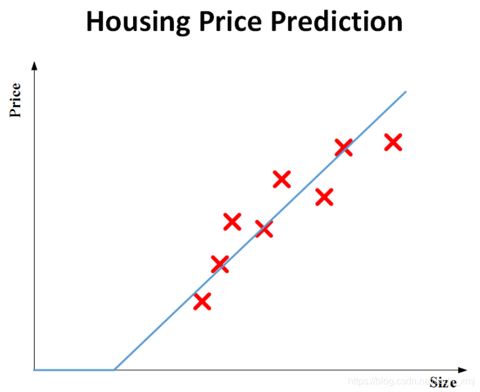
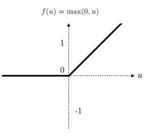
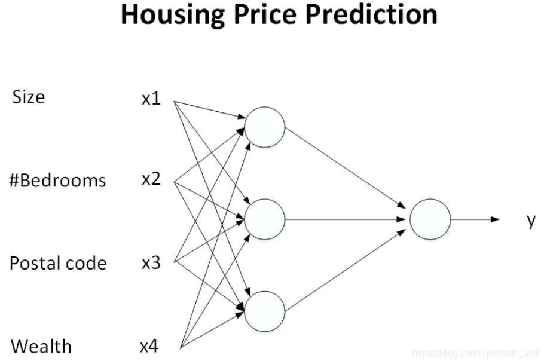
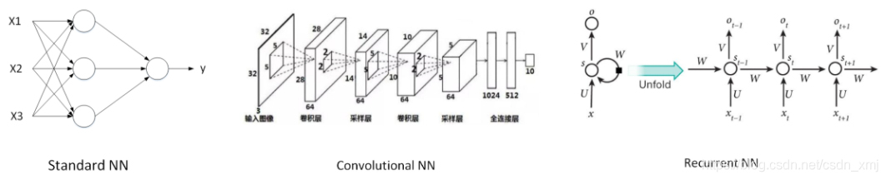
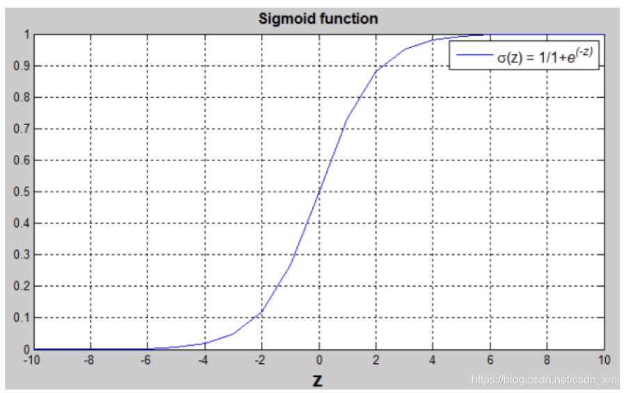
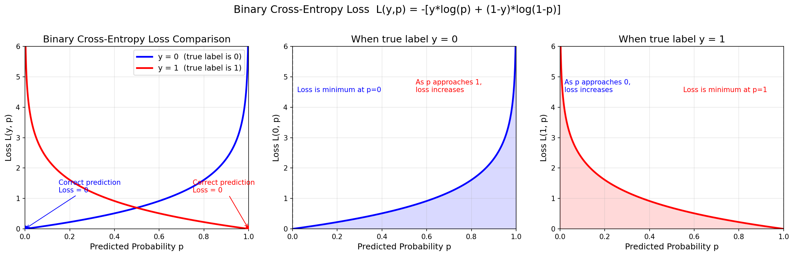
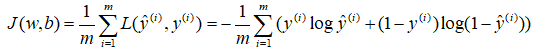
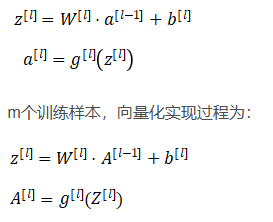
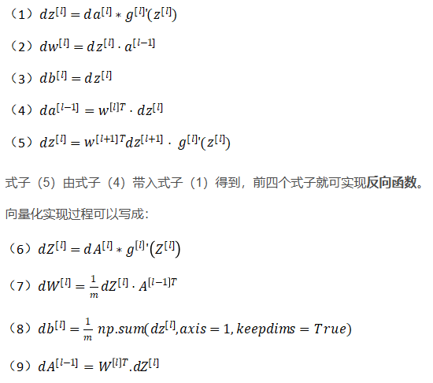

# 1deeplearning overview
- 简单来说，深度学习（Deep Learning）就是更复杂的神经网络（Neural Network）。
- 从预测房价开始，自变量x：size of house
- 因变量y：price 
- 根据这些输入输出来建立房价预测模型，来预测房价：y=f(x)
- 也许可以把这个房屋价格加一个拟合函数，看成是一个非常简单的神经网络。我们把房屋的面积作为神经网络的输入，记为x，通过一个节点(小圆圈)，最后输出了价格，用y表示
- 房价永远不可能为0，从实际考虑


- 这个简单的模型可以看作为一个神经网络， x(size) -> (neuron network) -> y(price)
- 这里的运算有一个取值运算，取不小于0的值;成为ReLU函数，修正线性单元(rectified linear unit)



当输入房子的参数变多,卧室数量，邮政编码，交通便利性等都考虑进来，预测价格，这就是一个基本的神经网络



## 1.1最重要的一个特点
输入x，就能得到输出y。不管训练集多大，它都会自己完成.怎么完成网络中的权重计算


这属于监督学习(supervised learning)
监督式学习与非监督式学习本质区别就是是否已知训练样本的输出y


## 1.2常见网络模型
1. 标准神经网络 : 线性问题(预测房价等等)
2. 卷积网络 : 图像识别
3. 循环神经网络 ： 语音[序列]信号



## 1.3神经网络强大的原因
1. 数据Data
2. 计算能力规模(算力) Computation
3. 算法 Algorithms

# 2neuron network basic
## 2.1二分类
例如识别猫，1代表猫，0代表不是猫
RGB 3 * 64 * 64 降维 = 12288 (降维成一维特征向量)

用一对(x,y)表示一个单独的样本，其中x是n_x维的特征向量，y为0或者1。训练集大小为m。train为训练集，test为测试集

定义一个矩阵X，矩阵有m列，n_x行，这里矩阵X的行n_x代表了每个样本x的特征个数，列m代表了样本个数。有时候矩阵X的定义是训练样本作为行向量堆叠，而不是这样列向量堆叠。在神经网络中，一般用列向量

## 2.2logistic回归
可以解决二分类问题

y = sigmiod(W * x + b) # 这里b作为一个常数项,y为1的概率，取值范围是(0,1)之间

sigmiod(z) = 1 / (1 + e^(-z))
sigmiod 是一种非线性的S函数，输出范围[0, 1],通常在神经网络中当激活函数(Activation function)



## 2.3logistic回归损失函数
逻辑回归中，w和b都是未知参数，即权重，需要反复训练优化得的，为了让模型通过学习调整参数，要给一个标准，知道实际输出和预期输出的差距是多少，即：Loss(error) function：损失函数（误差函数）

损失函数例如y为预期值，p为输出概率值:
1. L(y,p) = (y - p)^2
2. L(y,p) = (y- p)^2 / 2

以上两个在之后讨论的优化问题，发现会变成非凸的，最后会得到很多个局部最优解，梯度下降法可能找不到全局最优解,3号损失函数 这会给我们一个凸的优化问题。一般而言，我们偏向研究凸函数问题。

3. L(y,p) = -(ylogp + (1-y)log(1-p))常用！二元交叉熵损失函数

例子：

- (1)y=1时，L= - log(y^)想要足够小，y^就要足够大，最大最大不能超过1。
- (2)y=0时，L=- log(1-y^)想要足够小，(1-y^)要足够大，y^就要足够小，最小不能小于0。

"预测错了就惩罚"，比如用 |y - p| 或 (y-p)^2。这些也是损失函数（比如 MSE），但交叉熵在概率问题上有更好的数学性质（比如梯度更大、更容易训练、对极端错误惩罚更重）。


### 成本函数
它衡量的是在全体训练样本上的表现；成本函数J是根据之前得到的两个参数w和b，J(w,b)=损失函数求和/m.，即所有m个训练样本的损失函数和的平均。



成本函数(cost function)是关于未知参数w和b的函数，我们的目标是在训练模型时，要找到合适的w和b，让成本函数J尽可能的小。

结果表明，logistic回归可以看成是一个非常小的神经网络

## 2.4梯度下降法(Gradient Descent)

定义
$$L = -\frac{1}{N}\sum_{i=1}^{N}\left[y_i \log(\hat{y}_i) + (1-y_i)\log(1-\hat{y}_i)\right]$$

其中 $\hat{y} = \sigma(z) = \frac{1}{1+e^{-z}}$，即经过 sigmoid 激活后的输出。

求导过程
第一步：对 $\hat{y}$ 求偏导

$$\frac{\partial L}{\partial \hat{y}} = -\left[\frac{y}{\hat{y}} - \frac{1-y}{1-\hat{y}}\right] = \frac{\hat{y}-y}{\hat{y}(1-\hat{y})}$$

第二步：sigmoid 函数的导数

$$\frac{\partial \hat{y}}{\partial z} = \sigma(z)(1-\sigma(z)) = \hat{y}(1-\hat{y})$$

第三步：链式法则合并

$$\frac{\partial L}{\partial z} = \frac{\partial L}{\partial \hat{y}} \cdot \frac{\partial \hat{y}}{\partial z} = \frac{\hat{y}-y}{\hat{y}(1-\hat{y})} \cdot \hat{y}(1-\hat{y}) = \hat{y} - y$$

最终结果
$$\boxed{\frac{\partial L}{\partial z} = \hat{y} - y}$$

这个结果非常简洁，也是为什么二元交叉熵经常与 sigmoid 搭配使用的原因——求导后分母恰好被消掉，计算稳定且高效。


### Sigmoid 函数定义
$$\sigma(z) = \frac{1}{1 + e^{-z}} = (1 + e^{-z})^{-1}$$

详细求导步骤
第一步：设中间变量

令 $u = 1 + e^{-z}$，则 $\sigma = u^{-1}$

第二步：分别求导

外层：$\frac{d\sigma}{du} = -1 \cdot u^{-2} = -\frac{1}{u^2}$
内层：$\frac{du}{dz} = \frac{d}{dz}(1 + e^{-z}) = 0 + e^{-z} \cdot (-1) = -e^{-z}$
第三步：链式法则合并

$$\frac{d\sigma}{dz} = \frac{d\sigma}{du} \cdot \frac{du}{dz} = \left(-\frac{1}{u^2}\right) \cdot (-e^{-z}) = \frac{e^{-z}}{u^2}$$

代回 $u = 1 + e^{-z}$：

$$\sigma'(z) = \frac{e^{-z}}{(1 + e^{-z})^2}$$

第四步：化简为 $\sigma(1-\sigma)$ 的形式

将上式拆分为两个因子的乘积：

$$\sigma'(z) = \frac{1}{1 + e^{-z}} \cdot \frac{e^{-z}}{1 + e^{-z}}$$

观察第二个因子：

$$\frac{e^{-z}}{1 + e^{-z}} = \frac{(1 + e^{-z}) - 1}{1 + e^{-z}} = \frac{1+e^{-z}}{1+e^{-z}} - \frac{1}{1+e^{-z}} = 1 - \sigma(z)$$

第五步：最终结果

$$\boxed{\sigma'(z) = \sigma(z) \cdot (1 - \sigma(z))}$$

直观理解
这个结果的优美之处在于：sigmoid 的导数完全可以用它自身的输出表示，不需要再计算指数函数，这使得反向传播时计算效率极高。

### 单层网络（输入直接到输出）
网络结构：$x \rightarrow z \rightarrow \hat{y} \rightarrow L$

其中：

$z = \sum_j w_j x_j + b = W^T x + b$
$\hat{y} = \sigma(z)$
$L = -[y \log(\hat{y}) + (1-y)\log(1-\hat{y})]$
对单个权重 $w_j$ 求导
由链式法则：

$$\frac{\partial L}{\partial w_j} = \frac{\partial L}{\partial \hat{y}} \cdot \frac{\partial \hat{y}}{\partial z} \cdot \frac{\partial z}{\partial w_j}$$

各分项：

$\frac{\partial L}{\partial \hat{y}} \cdot \frac{\partial \hat{y}}{\partial z} = \hat{y} - y$（前面已推导）
$\frac{\partial z}{\partial w_j} = x_j$
因此：

$$\boxed{\frac{\partial L}{\partial w_j} = (\hat{y} - y) \cdot x_j}$$

对偏置 $b$ 求导
$$\frac{\partial z}{\partial b} = 1 \Rightarrow \boxed{\frac{\partial L}{\partial b} = \hat{y} - y}$$

矩阵形式（批量数据）
若有 $m$ 个样本，$X \in \mathbb{R}^{n_x \times m}$，则：

$$\frac{\partial L}{\partial W} = \frac{1}{m} X (\hat{Y} - Y)^T$$

最终代码:
```
#1.初始化
J=0; dw1=0; dw2=0; db=0;
#2.for循环遍历训练集，并且计算相应的每个训练样本的导数
for i = 1 to m
    z(i) = wx(i)+b;
    a(i) = sigmoid(z(i));
    J += -[y(i)log(a(i))+(1-y(i)）log(1-a(i));
    dz(i) = a(i)-y(i);
    dw1 += x1(i)dz(i);
    dw2 += x2(i)dz(i);#n=2,两个特征w1,w2
    db += dz(i);
#3.最终对所有的m个训练样本都进行了这个计算，你还需要除以m，计算平均值
J /= m;
dw1 /= m;
dw2 /= m;
db /= m;
```

向量化后代码:
```
Z = np.dot(w.T,X) + b
A = sigmoid(Z)
dZ = A-Y
dw = 1/m*np.dot(X,dZ.T)
db = 1/m*np.sum(dZ)
 
w = w - alpha*dw
b = b - alpha*db
```

# 3.多层神经网络

```
正向传播
变量	公式	                 形状
z1	z1 = W1^T · X + b1	     (h1, m)
a1	a1 = relu(z1)	         (h1, m)
z2	z2 = W2^T · a1 + b2	     (h2, m)
a2	a2 = relu(z2)	         (h2, m)
z3	z3 = W3^T · a2 + b3	     (1, m)
a3	a3 = sigmoid(z3)	     (1, m)
L	L = -(1/m)Σ[Y·log(a3) + (1-Y)·log(1-a3)]	标量
```

反向传播（微分式）


```
输出层:
dz3  = a3 - Y  形状: (1, m)
dW3  = (1/m) · a2 · dz3^T  形状: (h2, 1)
db3  = (1/m) · Σ(dz3)  形状: 标量

隐藏层2
dz2  = (W3 · dz3) ⊙ relu'(z2) 形状: (h2, m)
dW2  = (1/m) · a1 · dz2^T 形状: (h1, h2)
db2  = (1/m) · Σ(dz2, axis=1)  形状: (h2, 1)

隐藏层1
dz1  = (W2 · dz2) ⊙ relu'(z1) 形状: (h1, m)
dW1  = (1/m) · X · dz1^T   形状: (n_features, h1)
db1  = (1/m) · Σ(dz1, axis=1) 形状: (h1, 1)
其中 ⊙ 为逐元素相乘，relu'(z) = 1 if z > 0 else 0。

```





## 下述为微分相关的变量,有如下含义：

dw3 ~ a2 a3
dw2 ~ a3 a1 W3
dw1 ~ a3 W3

含义一：越靠近输入层，对损失的"影响路径"越长
```
W3  →  z3  →  a3  →  L          (直接影响，路径短)
W2  →  z2  →  a2  →  z3  →  a3  →  L   (间接影响，路径中等)
W1  →  z1  →  a1  →  z2  →  a2  →  z3  →  a3  →  L   (间接影响，路径最长)
```
W1 对损失的影响经过了3条链，所以它的梯度必须把这3条链上的所有局部偏导数全部乘起来。这就是 dW1 表达式里变量最多的原因。

含义二：梯度消失/爆炸的数学根源
把 dW1 完全展开看：

```
dW1 = dz1 · X^T
    = [W2 · dz2 ⊙ relu'(z1)] · X^T
    = [W2 · (W3 · dz3 ⊙ relu'(z2)) ⊙ relu'(z1)] · X^T
    = [W2 · (W3 · (a3-Y) ⊙ relu'(z2)) ⊙ relu'(z1)] · X^T
```
关键发现：从 a3 传回 W1，中间经历了多次矩阵乘法和激活函数导数的连乘：

```
dW1 ∝ W2 · W3 · relu'(z2) · relu'(z1) · (a3-Y) · X^T
          ↑____↑________↑_________↑
           权重矩阵连乘    激活函数导数连乘

如果 W2、W3 的元素大部分 > 1，连乘后数值会指数级爆炸 → 梯度爆炸
如果 W2、W3 的元素大部分 < 1，连乘后数值会指数级衰减到接近0 → 梯度消失
如果 relu'(z) 在某个区域为0，整个梯度链就会断掉 → 神经元死亡
含义三：浅层参数"感知"的是全局误差经过多层过滤后的信号
```

```
a3（输出误差）
   ↓
   W3 过滤一次  →  dz2
   ↓
   relu'(z2) 屏蔽一部分（把负值区域归零）
   ↓
   W2 再过滤一次  →  dz1
   ↓
   relu'(z1) 再屏蔽一部分
   ↓
   最后才传到 dW1
```
所以 W1 接收到的误差信号是最"失真"的——它经过了多层权重矩阵的缩放和多个 ReLU 的裁剪。这也是为什么深层网络训练困难，需要残差连接、BatchNorm 等技术来缓解。

总结
你看到的 dw1 ~ a3 W3 W2 X 这个规律，本质上是链式法则在多层网络上的必然表现：

层数越深，梯度表达式越长，包含的权重矩阵连乘项越多，数值稳定性越差。

这就是深度学习中所有关于"梯度稳定"的技术（如Xavier初始化、He初始化、残差连接、层归一化）要解决的问题核心。

## 初始化
同时 不同神经元的W不能初始化为同一零值(非零同一值也不行)，否则所有神经元会永远输出相同的值，失去表达能力
以代码中的隐藏层为例，h=4 个神经元，w1 的 shape 是 (2, 4)：

如果 w1 初始化为全零，则 z1 = 0·X + 0 = 0，4 个神经元的输出完全相同
反向传播时，4 个神经元得到的梯度 dw1 也完全相同
更新后 4 个神经元的权重仍然完全一样
无论训练多少轮，4 个神经元等价于 1 个神经元，隐藏层形同虚设
本质： 同一层中，对称初始化 → 对称输出 → 对称梯度 → 对称更新，这个对称性永远无法被打破。

1. 为什么权重 W 不能初始化为 0
如果 W 全为 0，那么前向传播时：


Z = Wᵀ·X + b = b   （所有神经元输出完全一样，跟 X 无关）
反向传播时每个神经元的梯度 dW = X·dZᵀ 也完全相同。这样所有神经元永远学到一样的东西、一起更新、永远无法分化——这叫「对称性问题」。网络退化成只有一个神经元在起作用，学不到任何东西。

2. 为什么偏置 b 初始化为 0 就没问题
偏置的作用是平移神经元的输出，它和输入 X 无关，每个神经元有自己独立的 b。即使一开始所有 b 都是 0：

反向传播时，b 的梯度是 db = (1/m)·Σ(dZ)，它来自损失函数对输出的误差。
只要输出的误差 dZ = A - Y 不为 0，b 就会收到梯度、被正常更新。
而且每个神经元的 b 梯度不同，它们会各自朝着自己的最优值走，不会「锁死」在同一个值。
所以 b=0 只是一个无伤大雅的起点，训练一开始就能被梯度「推动」起来。

## 隐层宽度与网络深度
提高宽度也能带来网络的提升，但远不如提升深度；
例如 1个特征需要16个维度来表示，那么可能需要一个隐层16个神经单元可以解决，如果两个隐层 4 ， 4 需要的神经单元大大减少也可以表示相同的特征
但是LLM由于并行计算，现在也在拼命扩充宽度


## 超参数
1. 神经网络层数
2. 各层神经网络单元参数
3. 学习率
4. 梯度下降法的学习参数
5. 激活函数的选择
6. 梯度下降循环次数
7. mini batch大小
8. 正则化参数等等
