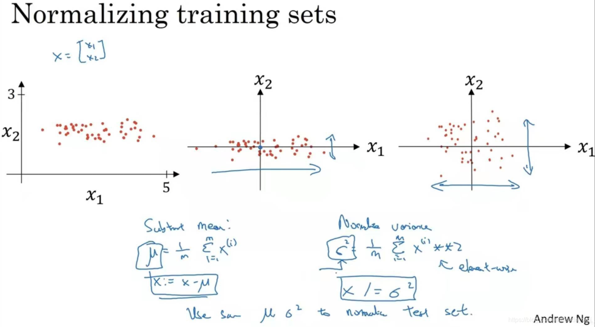

# 深度学习进阶 (Deep Learning Improvement)

## 1. 机器学习策略 (ML Strategy)

### 1.1 训练集/验证集/测试集 (Train/Dev/Test sets)

在机器学习中，通常将样本分成**训练集**、**验证集**和**测试集**三部分：

- **训练集 (Training Set)**: 用于训练模型参数（权重w和偏置b）
- **验证集 (Development/Validation Set)**: 用于调整超参数、选择模型、防止过拟合
- **测试集 (Test Set)**: 用于最终评估模型的泛化能力

#### 数据划分比例

- **小数据集** (< 10万条): 传统划分比例
  - 训练集: 60%
  - 验证集: 20%
  - 测试集: 20%

- **大数据集** (> 100万条): 验证集和测试集占比可降低
  - 训练集: 98%
  - 验证集: 1%
  - 测试集: 1%

#### 重要原则

1. **验证集和测试集应来自同一分布**: 确保评估的有效性
2. **测试集只使用一次**: 避免根据测试结果反复调整模型导致过拟合
3. **数据量充足时**: 验证集和测试集可以占到数据总量的20%或10%以下

---

### 1.2 偏差/方差 (Bias/Variance)

诊断模型的两种主要问题：

#### 高偏差 (High Bias) - 欠拟合 (Underfitting)

- **表现**: 
  - 训练集准确率低
  - 验证集准确率也低
  - 两者差距不大
  
- **原因**: 模型太简单，无法捕捉数据的复杂模式

- **解决方案**:
  - 增加网络层数或神经元数量
  - 增加特征数量
  - 减少正则化强度
  - 尝试更复杂的模型架构

#### 高方差 (High Variance) - 过拟合 (Overfitting)

- **表现**:
  - 训练集识别率高（接近100%）
  - 验证集识别率低
  - 两者差距很大
  
- **原因**: 模型过于复杂，记住了训练数据的噪声而非规律

- **解决方案**:
  - 增加训练数据量
  - 使用正则化技术 (L1/L2 regularization)
  - Dropout随机失活
  - 简化模型结构
  - 早停法 (Early Stopping)

#### 理想状态

- 训练集准确率高
- 验证集准确率也高
- 两者差距小

---


### 1.3 基本机器学习设置 (Basic ML Setup)

#### 误差分析流程

1. **建立基线 (Baseline)**: 确定人类水平或当前最佳性能
2. **分析错误**: 手动检查验证集上的错误案例
3. **优先解决**: 找出最容易改进且影响最大的问题
4. **快速迭代**: 快速实验，根据结果调整策略


- 如果碰到高偏差（欠拟合），通常是增加神经网络的隐藏层层数、神经元个数，训练时间延长，选择其它更复杂的NN模型等
- 其次，减少高方差（过拟合）的方法通常是增加训练样本数据，但有时无法获得更多的数据，进行正则化（Regularization）来减少过拟合

#### 正交化 (Orthogonalization)

- 每个步骤只解决一个具体问题
- 避免同时调整多个因素
- 便于定位问题和理解因果关系

---

### 1.4 正则化 Regularization


在成本函数中添加权重的平方和：

$$J(w,b) = \frac{1}{m}\sum L(\hat{y}, y) + \frac{\lambda}{2m}\sum ||w||^2$$

#### 梯度更新

$$w := w - \alpha\left[\frac{\partial J}{\partial w} + \frac{\lambda}{m}w\right]$$

等价于：

$$w := (1 - \frac{\alpha\lambda}{m})w - \alpha\frac{\partial J}{\partial w}$$

所以也叫**权重衰减**。

#### 效果

- 抑制大权重值
- 使模型更简单平滑
- λ越大，正则化越强


#### 原因
正则化λ设置得足够大，权重矩阵W被设置为接近于0的值，就是把多隐层单元的权重设为0，于是基本上消除了那些隐藏单元的许多影响。这种情况下，复杂神经网络就被简化成很小的网络，同时深度很大，它会使这个网络从过拟合的状态更接近于左图的高偏差状态。但是λ有个中间值，使得接近“just right”的中间状态。因此，选择合适大小的λ值，就能够同时避免高偏差（high bias）和高方差（high variance），得到最佳模型。

### 1.5 Dropout 随机失活

当网络过拟合时，dropout 按概率随机"杀死"部分神经元，使网络不依赖某些特定神经元，从而降低过拟合。

#### 代码实现（Inverted Dropout）

```python
# 第1步：生成随机掩码，keep_prob 为保留概率
d3 = np.random.rand(a3.shape[0], a3.shape[1]) < keep_prob

# 第2步：置零被杀死的神经元
a3 = np.multiply(a3, d3)  # 等价于 a3 *= d3

# 第3步：除以 keep_prob，修正期望值
a3 /= keep_prob
```

#### 为什么要除以 keep_prob？

dropout 置零了一部分神经元，**输出期望缩小了**。除以 `keep_prob` 是为了把期望修正回原来的水平。

| 场景 | 期望输出 |
|------|---------|
| 不做 dropout | E[a] = Σaᵢ |
| dropout 不除回来 | E[a] = keep_prob × Σaᵢ（缩小了） |
| dropout 除回来 | E[a] = keep_prob × Σaᵢ / keep_prob = Σaᵢ（不变） |

举例：4个神经元输出 [2, 4, 6, 8]，keep_prob = 0.5

- 不做 dropout：总和 = 20
- dropout 不除回来：平均杀掉一半，期望总和 = 20 × 0.5 = 10
- dropout 除回来：期望总和 = 10 / 0.5 = 20，和原来一致

#### 为什么测试时不做 dropout？

测试时所有神经元都保留，输出本身就是 Σaᵢ。训练时已经除回来了，数值尺度天然一致，测试代码无需任何额外处理。

#### 梯度计算需要改变吗？

不需要。`mask / keep_prob` 是前向计算图的一部分，反向传播时链式法则自动处理。

**前向：**

```
a_drop = a ⊙ mask / keep_prob
```

**反向链式推导：**

```
∂L     ∂L        ∂a_drop
─── = ────── · ────────
∂a     ∂a_drop      ∂a

∂L        ∂a_drop
───── = dz_drop · ────────
∂a               ∂a

∂a_drop/∂a = mask / keep_prob    （常数因子，不随 a 变化）

∴ da = dz_drop · mask / keep_prob
```

`mask / keep_prob` 在前向时已经确定，反向时直接乘上去即可，**无需手动修改任何梯度公式**。

#### dW 会包含 keep_prob 吗？

会，但不需要手动加。假设第3层做了 dropout，第4层是输出层：

**前向：**

```
a3_drop = a3 ⊙ mask / keep_prob
z4 = W4^T · a3_drop + b4
```

**dW4 推导：**

```
dW4 = ∂L/∂W4
    = ∂L/∂z4 · ∂z4/∂W4
    = dz4 · a3_drop^T
    = dz4 · (a3 ⊙ mask / keep_prob)^T
    = dz4 · (a3 ⊙ mask)^T / keep_prob
```

keep_prob 通过 a3_drop 间接进入了 dW4，链式法则自动带入，无需手动处理。

**各参数与 keep_prob 的关系：**

| 参数 | 推导式 | keep_prob 来源 |
|------|--------|---------------|
| da3 | dz4 · W4 ⊙ mask / keep_prob | 直接包含 |
| dW4 | dz4 · a3_drop^T | 通过 a3_drop 间接包含 |
| db4 | Σ(dz4) | 不包含（与 a3_drop 无关） |

#### 理解dropout
dropout 是一种 prevent overfitting 的方法，通过随机“杀死”部分神经元，使网络不依赖某些特定神经元，从而降低过拟合。

### 其他正则化
1. 对于图片
- 随机裁剪：随机裁剪图片，使图片尺寸变小，从而增加数据量，并避免过拟合。
- 随机旋转：随机旋转图片，使图片角度变化，从而增加数据量，并避免过拟合。
- 造假数据：造假数据，使数据量变大，从而增加数据量，并避免过拟合。

2. early stopping：在训练过程中，如果验证集的准确率开始下降，就停止训练，从而避免过拟合。


### 正则化输入
输入数据正则化，即对输入数据进行预处理，使得输入数据更加符合正态分布，从而提高模型的预测效果。即归一化数据，有两个步骤：

1. **零均值化**：将数据减去均值，使得数据零均值化。
   
   计算均值：$\mu = \frac{1}{m}\sum_{i=1}^{m} x^{(i)}$
   
   零均值化：$x := x - \mu$

2. **标准化**：将数据除以标准差，使得数据具有单位方差。
   
   计算方差：$\sigma^2 = \frac{1}{m}\sum_{i=1}^{m} (x^{(i)} - \mu)^2$
   
   标准化：$x_{\text{norm}} = \frac{x - \mu}{\sigma}$




#### why
1. **消除均值偏移**：比如一个特征的均值是 100，另一个是 0，直接训练时模型会被大均值的特征主导，零均值化可以消除这种偏移。
2. **统一方差尺度**：比如一个特征的方差是 1000，另一个是 1，梯度下降时损失函数会变成 "椭球形"，收敛极慢；归一化后方差都为 1，损失函数变成 "球形"，梯度下降效率大幅提升。