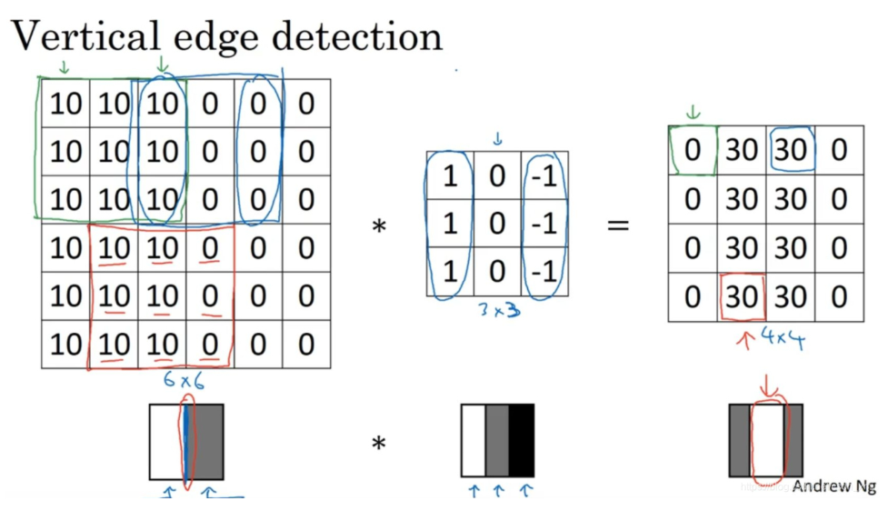
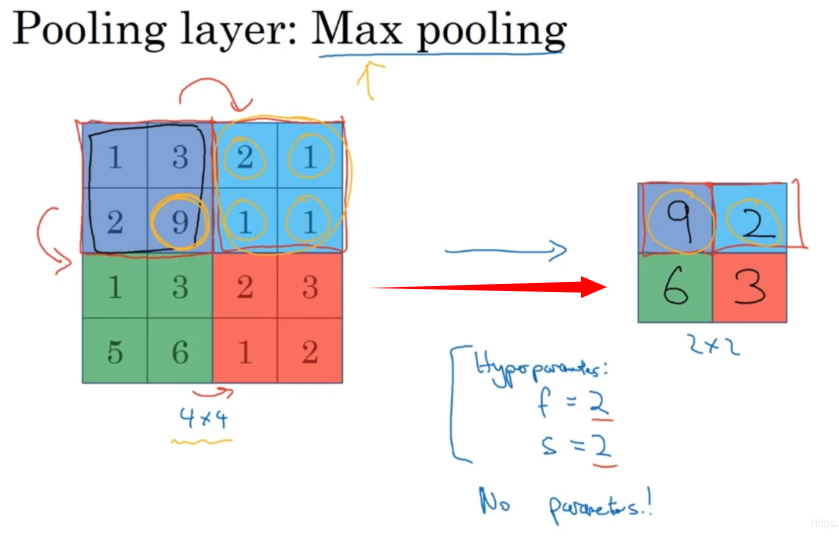

# 卷积神经网络（Convolutional Neural Network）

## 边缘检测示例
这是一个6×6的灰度图像（grayscale image）它是6×6×1的矩阵为了检测图像中的垂直边缘，需要构造一个3×3矩阵,它被称为过滤器（filter），也被称为核（kernel）.这张6×6的图片，左边较亮，而右边较暗;将它与垂直边缘检测滤波器进行卷积，检测结果就显示在了右边这幅图的中间部分.从结果可以看到这个过滤器确实可以区分这两种明暗变化的区别。

## 填充(Padding)
3×3的过滤器卷积一个6×6的图像，你最后会得到一个4×4的输出，也就是一个4×4矩阵

n×n的图像，用f×f的过滤器，步进为1，做卷积，那么输出的维度就是(n - f + 1) × (n - f + 1)

这样的话会有两个缺点，
1. 第一个缺点是每次做卷积操作，你的图像就会缩小。
2. 第二个缺点是那些在角落或者边缘区域的像素点在输出中采用较少，意味着你丢掉了图像边缘位置的许多信息

可以在卷积操作之前填充这幅图像,解决以上两个问题；习惯上，可以用0填充，p表示填充的数量,p=1表示再周围都填充一个像素点
(n + 2p - f + 1) × (n + 2p - f + 1)

**填充数据量**: 利用n+2p-f+1=n求解，使得输出和输入大小相等，那么p = (f - 1)/2； 

计算机视觉中，f通常是奇数,原因如下:
1. 如果f是一个偶数，那么你只能使用一些不对称填充（asymmetric padding）。只有是奇数的情况下，Same卷积才会有自然的填充，我们可以以同样的数量填充四周，而不是左边填充多一点，右边填充少一点，这样不对称的填充

2. 第二个原因是当你有一个奇数维过滤器（odd dimension filter），比如3×3或者5×5的，它就有一个中心点（central position）。有时在计算机视觉里，如果有一个中心像素点（central pixel）会更方便，便于指出过滤器的位置

## 卷积步长(Strided Convolutions)
s为步长
$$\left( \frac{n+2p-f}{s} + 1 \right) \times \left( \frac{n+2p-f}{s} + 1 \right)$$

除法部分向下取整，原因:

这个原则实现的方式是，你只在卷积核完全包括在图像或填充完的图像内部时，才对它进行运算。如果有任意一个蓝框移动到了外面，那就不要进行相乘操作，这是一个惯例

## 三维卷积(Convolutions Over Volume)
假如说你不仅想检测灰度图像的特征，也想检测RGB彩色图像（红、绿、蓝）的特征。彩色图像如果是6×6×3，这里的3指的是三个颜色通道（可以想象成三个6×6图像的堆叠）

为了检测图像的边缘或者其他的特征，可以跟一个三维的过滤器做卷积，它的维度是3×3×3，这样这个过滤器也有三层，对应红绿、蓝三个通道

### 多个多滤器
例:
一个6×6×6的输入图像卷积上一个3×3×3的过滤器，得到一个4×4的二维输出。如果需要检测更多维度的数据怎么办？45%，边缘，70%倾斜等

可以用多个过滤器做卷积运算，如6 * 6 * 3 的图像使用2个 3 * 3 * 3的卷积核做运算，输出:
4 * 4 * 2的特征图

## 单层卷积

### 一、 卷积层的核心工作原理
1. **单次卷积操作**：输入图像与过滤器进行卷积（类似线性乘积 $W^{[1]}*a^{[0]}$），输出矩阵。
2. **加偏差**：每个过滤器的输出矩阵加上同一个实数偏差 $b$（利用广播机制）。
3. **非线性激活**：对加偏后的结果应用激活函数（如ReLU），得到最终的特征映射矩阵（类似 $z^{[1]} \rightarrow a^{[1]}$）。
4. **堆叠输出**：将所有过滤器的输出矩阵在深度方向上堆叠，形成该层最终的输出。

> **示例**：6×6×3的输入，经过2个过滤器卷积（输出4×4），加偏并激活后，堆叠成 **4×4×2** 的输出矩阵，完成 $a^{[0]}$ 到 $a^{[1]}$ 的演变。

---

### 二、 参数计算与优势
- **单个过滤器参数** = 过滤器自身维度（$f \times f \times c$） + 1个偏差 $b$
- **一层总参数** = 单个过滤器参数 × 过滤器数量
- **示例**：10个 3×3×3 的过滤器，总参数 = (27 + 1) × 10 = **280个**
- **CNN优势（避免过拟合）**：**参数数量与输入图像大小无关**。无论输入图片多大，参数量始终只取决于过滤器尺寸和数量，有效避免了过拟合。

---

### 三、 符号与维度标记（第 $l$ 层）
| 符号 | 含义 |
| :--- | :--- |
| $f^{[l]}$ | 过滤器大小 |
| $p^{[l]}$ | Padding数量 |
| $s^{[l]}$ | 步幅 |
| $n_H^{[l-1]}, n_W^{[l-1]}, n_C^{[l-1]}$ | 输入维度（高、宽、通道数） |

### 1. 输出维度
- **高度/宽度**：$n_H^{[l]} = \lfloor \frac{n_H^{[l-1]} + 2p^{[l]} - f^{[l]}}{s^{[l]}} + 1 \rfloor$ ，$n_W^{[l]}$同理
- **通道数（深度）**：$n_C^{[l]}$ = **该层过滤器的数量**

### 2. 过滤器维度
$$ f^{[l]} \times f^{[l]} \times n_C^{[l-1]} $$
*(注：过滤器的通道数必须等于输入的通道数)*

### 3. 激活值维度
- **单样本**：$a^{[l]}$ 的维度为 $n_H^{[l]} \times n_W^{[l]} \times n_C^{[l]}$
- **批量 ($m$个样本)**：$A^{[l]}$ 的维度为 $m \times n_H^{[l]} \times n_W^{[l]} \times n_C^{[l]}$

### 4. 权重与偏差维度
- **权重 $W^{[l]}$**：所有过滤器的集合，维度为 $f^{[l]} \times f^{[l]} \times n_C^{[l-1]} \times n_C^{[l]}$
- **偏差 $b^{[l]}$**：每个过滤器一个实数，逻辑上为 \$1 \times 1 \times 1 \times n_C^{[l]}$ 的四维张量/向量

---

## 四、 注意事项
- **通道顺序**：不同框架对维度顺序（如通道在前还是高度/宽度在前）的定义可能不同，编写代码时需保持一致。本课采用 **(高度, 宽度, 通道数)** 的顺序。
- **总结**：理解单层卷积的工作原理（线性卷积+偏置+非线性激活），就可以通过堆叠多层来构建深度卷积神经网络。

## 池化层(Pooling Layers)
最大池化层: 人们使用最大池化的主要原因是此方法在很多实验中效果都很好

池化的输出维度同卷积运算一致

它有一组超参数，但并没有参数需要学习。在实际操作中，一旦确定f和s，就是一个固定运算，梯度下降无需改变任何值。它只是计算神经网络某一层的静态属性（fixed function）

还有一种叫平均池化

## 为什么使用卷积
1. 参数共享（parameter sharing）
- 32×32×3维度的图片，假设用了6个大小为5×5的过滤器，输出维度为28×28×6。我们构建一个神经网络，其中一层含有32×32×3=3072个单元，下一层含有28×28×6=4704个单元

- 如果采用全连接的方式，两层中的每个神经元彼此相连，然后计算权重矩阵，它等于4074×3072≈1400万，所以要训练的参数很多

9个参数同样能计算出n个输出。它不仅适用于边缘（edges）特征这样的低阶特征（low level features），同样适用于高阶特征（high level features），例如提取脸上的眼睛，猫或者其他特征对象。

2. 稀疏连接（sparsity of connections）
通过3×3的卷积计算得到的下一层某一个元素值，它只依赖于这个3×3的输入的单元格，输出单元（元素0）仅与36个输入特征中9个相连接。而且其它像素值都不会对输出产生任影响，这就是稀疏连接的概念。